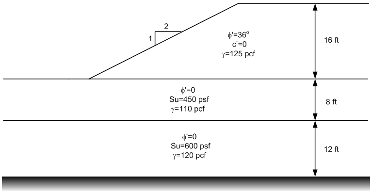

# Homework - Important Details of Stability Analysis

Start with the standard Excel input template:

[input_template.xlsx](https://xslope.org/en/latest/inputs/input_template.xlsx)

Solve using the XSLOPE Google Colab notebook for stability analysis:

Complete the following two problems:

1) Consider the following slope:

Create the inputs for the problem using the XSLOPE input template. Find the global-minimum factor of safety by trying several different starting locations for the automated search. Save your solution.

2) Consider the following slope:

Create the inputs for the problem using the XSLOPE input template. Then compute a solution for the following three conditions (save each version to a different file name):

a) As-is with no tension crack. Save a copy of your solution.

b) Note that you have tension in the active zone. Use a spreadsheet to estimate the appropriate depth for a tension crack using the equations we discussed in class using an estimated factor of safety. Enter this tension crack depth on the **main** sheet and recompute the factor of safety. Adjust the depth of the crack up and down until you find a depth that is just on the threshold of eliminating tension. Save a copy of your solution.

c) Fill your tension crack with water (enter the water level on the **main** sheet) and iterate again. Save a copy of your solution.

## Submission

Zip up all four Excel input files and the spreadsheet with your tension crack calculations into a single zip archive. Upload your zip archive via Learning Suite.

## Grading Rubric

**Total: 30 points**

| Criteria | Points |
|----------|:------:|
| Problem 1: XSLOPE model setup | 5 |
| Problem 1: Multiple search locations attempted | 3 |
| Problem 1: Global minimum FS found | 4 |
| Problem 2a: As-is solution | 5 |
| Problem 2b: Tension crack depth determination | 6 |
| Problem 2b: Iterative adjustment and new FS | 3 |
| Problem 2c: Water-filled crack solution | 3 |
| Documentation quality | 1 |
