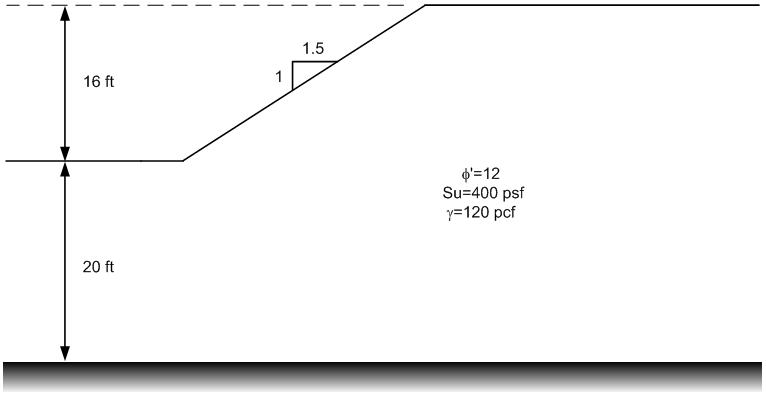

# Homework - Important Details of Stability Analysis

Complete the following two problems:

1) Consider the following slope:

Create the inputs for the problem using UTEXASED. Find global-minimum factor safety by trying several different starting locations for the automated search. Save your solution.

2) Consider the following slope:

Create the inputs for the problem using UTEXASED. Then compute a solution for the following three conditions (save each version to a different file name):

a) As-is with no tension crack.

b) Note that you have tension in the active zone. Use a spreadsheet to estimate the appropriate depth for a tension crack using the equations we discussed in class. Estimate the factor of safety. Turn on the tension crack and recompute the factor of safety. Update your tension crack depth estimate based on the factor of safety and repeat until the estimated factor of safety is close to the computed factor of safety.

c) Fill your tension crack with water and update the solution.

## Submission

Zip up all four solutions (the INPUT file for UTEXASED) and the spreadsheet into a single zip archive. Upload your zip archive via Learning Suite.