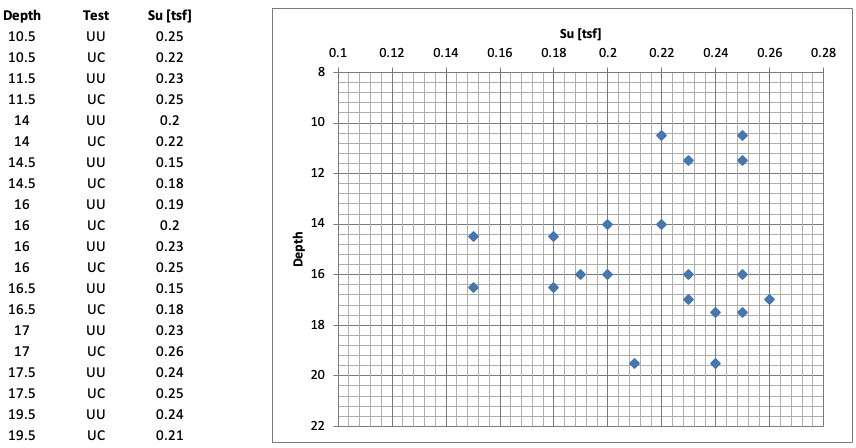
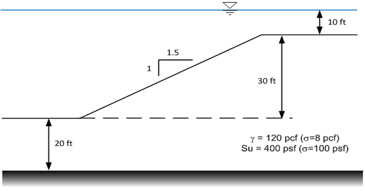

# Exercise - Reliability Analysis

In this exercise, we will perform reliablity analyses related to slope stability.

## Problem 1 - Reliability Calculations

The following data represent undrained shear strength values for San Francisco Bay Mud - Hamilton Air Force Base in 
Marin County, CA (see Table 13.3 in text).

1) Calculate the standard deviation and coefficient of variation (COV) of the undrained shear strength values.

2) Use the graphical/Simplified method of calculating the standard deviation of the undrained shear strength values. 
   Use both the 3$\sigma$ (factor of 6) method. Repeat using a factor of 4. Compare to the value found in part (1). 
   Which is the most conservative?

3) Given the following values:

| Parameter | Value |
|:---------:|:-----:|
| $F_{MLV}$ | 1.17  |
|  $COV_F$  | 15.8% |

Calculate the log-normal reliability index ($\beta_{LN}$), reliability (R) and probability of failure (Pf). Compare to 
the chart solution in the text. Recall that the reliability index is given by:

$$
\beta_{LN} = \frac{ln\left(\dfrac{F_{MLV}}{\sqrt{1 + COV_F^2}}\right)}{\sqrt{ln\left(1 + COV_F^2\right)}}
$$

Use the following Excel or Python file to perform your calculations. For the Python solution, you will need upload 
the CSV file with the bay mud data values.

Excel starter file: [reliability_calc.xlsx](reliability_calc.xlsx)

Excel solution file: [reliability_calc_KEY.xlsx](reliability_calc_KEY.xlsx)

Python starter file: 

Python solution file: 

CSV file with bay mud data values: [bay_mud_data.csv](bay_mud_data.csv)

## Problem 2 - Reliability Analysis

Consider the following slope:

The numbers shown in parentheses next to the unit weight and undrained strength represent estimates of the standard deviation for the two parameters. Using a spreadsheet and the UTEXASED program, calculate the reliablity and the propability of failure for the slope using the Taylor Series method.

1) Find the factor of safety for the most likely values ($F_{MLV}$). The profile line, distributed load, and starting circle location are included in the Excel file below. Solve for the $F_{MLV}$ using UTEXASED.

2) Use the Taylor Series method to find the COV of the factor of safety ($COV_F$). For each parameter, find the 
   $MLV+\sigma$ and $MLV-\sigma$ values. Use UTEXASED to find the factor of safety for each. Then calculate $\Delta F$ and $(\Delta F/2)^2$ for each parameter. The standard deviation and covariance of failure are then given by:

$$
\sigma_F = \sqrt{\left(\dfrac{\Delta F_1}{2}\right)^2 + \left(\dfrac{\Delta F_2}{2}\right)^2 + ... + \left(\dfrac
{\Delta F_N}{2}\right)^2}
$$

$$
COV_F = \dfrac{\sigma_F}{F_{MLV}}
$$

3) Using the $\sigma_F$ and $COV_F$ values, calculate the $\beta_{LN}$, reliability (R) and probability of failure 
   (Pf) for the slope.

Use the following Excel file to perform your calculations. 

Excel starter file: [covf.xlsx](covf.xlsx)

Excel solution file: [covf_KEY.xlsx](covf_KEY.xlsx)

