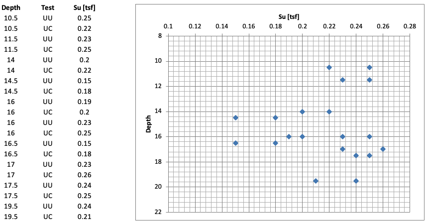
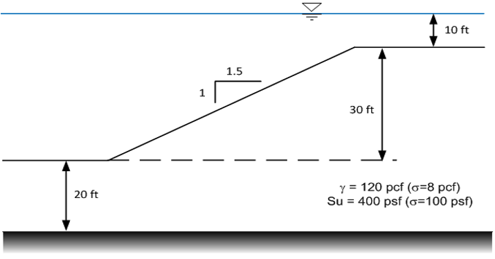

# Exercise - Reliability Analysis

In this exercise, we will perform reliablity analyses related to slope stability.

## Problem 1 - Reliability Calculations

The following data represent undrained shear strength values for San Francisco Bay Mud - Hamilton Air Force Base in
Marin County, CA (see Table 13.3 in text).

1) Calculate the standard deviation and coefficient of variation (COV) of the undrained shear strength values.

2) Use the graphical/Simplified method of calculating the standard deviation of the undrained shear strength values.
   Use both the 3$\sigma$ (factor of 6) method. Repeat using a factor of 4. Compare to the value found in part (1).
   Which is the most conservative?

3) Given the following values:

| Parameter | Value |
|:---------:|:-----:|
| $F_{MLV}$ | 1.17  |
|  $COV_F$  | 15.8% |

Calculate the log-normal reliability index ($\beta_{LN}$), reliability (R) and probability of failure (Pf). Compare to
the chart solution in the text. Recall that the reliability index is given by:

>>$\beta_{LN} = \dfrac{ln\left(\dfrac{F_{MLV}}{\sqrt{1 + COV_F^2}}\right)}{\sqrt{ln\left(1 + COV_F^2\right)}}$

Use the following Excel or Python file to perform your calculations. For the Python solution, you will need upload
the CSV file with the bay mud data values.

Excel starter file: [reliability_calc.xlsx](files/reliability_calc.xlsx) 
Excel solution file: [reliability_calc_KEY.xlsx](files/reliability_calc_KEY.xlsx)

Python starter file:  
Python solution file: 

CSV file with bay mud data values: [bay_mud_data.csv](files/bay_mud_data.csv)

Solution: [reliability_calc_KEY.xlsx](files/reliability_calc_KEY.xlsx)
Solution: [reliability_calc_KEY.ipynb](files/reliability_calc_KEY.ipynb)

## Problem 2 - Reliability Analysis

Consider the following slope:

The numbers shown in parentheses next to the unit weight and undrained strength represent estimates of the standard deviation for the two parameters. Using XSLOPE, calculate the reliability and probability of failure for the slope using the built-in reliability analysis feature.

Start with the standard Excel input template:

[input_template.xlsx](https://xslope.org/en/latest/inputs/input_template.xlsx)

Do the following:

1) Build the slopemodel in the XSLOPE input template using the geometry shown above. Enter the most likely values (MLV) for the material properties and the standard deviations ($\sigma$) for each parameter on the **materials** sheet.

2) Upload the input file to the XSLOPE Google Colab notebook and run the built-in reliability analysis:

3) Examine the following results: $F_{MLV}$, $\sigma_F$, $COV_F$, $\beta_{LN}$, reliability (R), and probability of failure (Pf).

Solution: [xslope_prob_submerged_KEY.xlsx](files/xslope_prob_submerged_KEY.xlsx)

## Problem 3 - Johnson Reservoir Reliability Analysis

Revisit the Johnson Reservoir dam:

The material properties and associated standard deviations are as follows:

| Material   | $\gamma$ (pcf) | c (psf) | $\phi$ (deg) | $\sigma_\gamma$ (pcf) | $\sigma_c$ (psf) | $\sigma_\phi$ (deg) |
|:----------:|:------:|:------:|:------:|:------:|:------:|:------:|
| Shell      | 130    | 100    | 35     | 7      | 25     | 5      |
| Core       | 125    | 400    | 18     | 6      | 150    | 4    |
| Foundation | 127    | 100    | 27     | 7      | 30     | 6    |

The pore pressure option ($u$) for each material is set to `seep`. Download the following zip archive which includes the Excel input file, mesh file, and seepage solution already prepared:

[johnson_res_prob.zip](files/johnson_res_prob.zip)

Do the following:

1) Unzip the archive and open the Excel input file. Enter the standard deviations ($\sigma$) for each parameter on the **materials** sheet. Re-zip the files into a new archive.

2) Upload the zip archive to the XSLOPE LEM notebook and run the built-in reliability analysis:

3) Examine the following results: $F_{MLV}$, $\sigma_F$, $COV_F$, $\beta_{LN}$, reliability (R), and probability of failure (Pf).

4) Comment on the results. Is the dam acceptable from a reliability standpoint?

Solution: [johnson_res_prob__KEY.zip](files/johnson_res_prob__KEY.zip)
