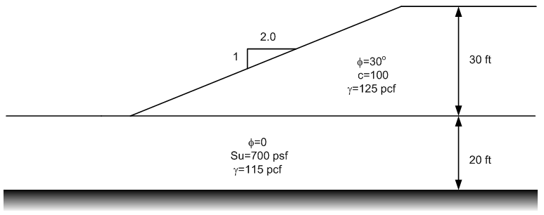

# Homework - Reliability Analysis

Consider the following slope:

Each of the non-zero parameters have been anayzed and a standard deviation has been estimated for each as follows:

| Parameter  | MLV | $\sigma$ |
|:----------:|:---:|:--------:|
|  $\phi_1$  | 30  |   4.5    |
|   $c_1$    | 100 |    20    |
| $\gamma_1$ | 120 |   9.1    |
|   $Su_2$   | 700 |   150    |
| $\gamma_1$ | 115 |   7.2    |

Perform a reliability analysis on the slope to find both the reliability (R) and probability of failure (Pf). Use the Taylor Series Method to find COVF and perform your slope stability calculations using UTEXASED. Summarize all of your calculations in a spreadsheet.

## Submission

Zip up a copy of your UTEXASED input file (with MLV parameters) and the spreadsheet into a single zip archive. Upload your zip archive via Learning Suite.