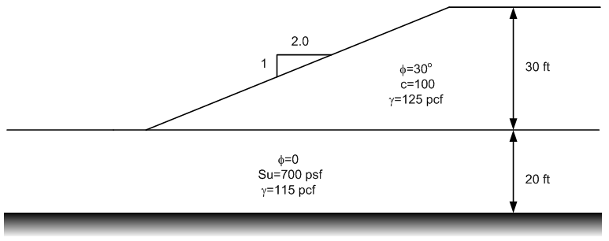

# Homework - Reliability Analysis

In this assignment, you will use XSLOPE to perform reliability analyses on two slope stability problems using the built-in reliability analysis feature.

Start with the standard Excel input template:

[input_template.xlsx](https://xslope.org/en/latest/inputs/input_template.xlsx)

Solve using the XSLOPE Google Colab notebook for stability analysis:

## Problem 1 - Two-Layer Slope

Consider the following slope:

The material properties and associated standard deviations are as follows:

| Material | $\gamma$ (pcf) | c (psf) | $\phi$ (deg) | $\sigma_\gamma$ (pcf) | $\sigma_c$ (psf) | $\sigma_\phi$ (deg) |
|:--------:|:------:|:------:|:------:|:------:|:------:|:------:|
| Layer 1  | 125    | 100    | 30     | 9.1    | 20     | 4.5    |
| Layer 2  | 115    | 700    | 0      | 7.2    | 200    | -      |

Do the following:

1) Build the slope model in the XSLOPE input template. Enter the material properties and the standard deviations ($\sigma$) for each parameter on the **materials** sheet.

2) Upload the input file and run the built-in reliability analysis.

3) Examine the results: $F_{MLV}$, $\sigma_F$, $COV_F$, $\beta_{LN}$, reliability (R), and probability of failure (Pf).

4) Save a copy of your Excel input template and a PNG of the reliability analysis results.

## Problem 2 - Earth Dam

Revisit the earth dam problem from the XSLOPE Part 2 homework:

Use your existing Excel input file from the XSLOPE LEM Part 2 homework (with the piezometric line). The material properties and associated standard deviations are as follows:

| Material | $\gamma$ (pcf) | c' (psf) | $\phi$' (deg) | $\sigma_\gamma$ (pcf) | $\sigma_{c'}$ (psf) | $\sigma_{\phi'}$ (deg) |
|:--------:|:------:|:------:|:------:|:------:|:------:|:------:|
| Shell    | 125    | 0      | 34     | 7      | -      | 6      |
| Core     | 122    | 100    | 26     | 6      | 40     | 5    |
| Clay     | 123    | 0      | 24     | 7      | -      | 5      |
| Sand     | 127    | 0      | 32     | 7      | -      | 6      |

Do the following:

1) Add the standard deviations ($\sigma$) for each parameter on the **materials** sheet of your existing input file.

2) Upload the input file and run the built-in reliability analysis for the downstream side.

3) Report the following results: $F_{MLV}$, $\sigma_F$, $COV_F$, $\beta_{LN}$, reliability (R), and probability of failure (Pf).

4) Examine the results. Does the dam seem reliable?

5) Save a copy of your Excel input template and a PNG of the reliability analysis results. 

## Submission

Save a copy of your XSLOPE Excel input files and solution PNG files for both problems. Zip up your files into a single zip archive. Upload your zip archive via Learning Suite.

## Grading Rubric

**Total: 30 points**

### Problem 1: Two-Layer Slope (13 pts)

| Criteria | Points |
|----------|:------:|
| XSLOPE model setup with correct geometry and material properties | 3 |
| Standard deviations entered correctly on materials sheet | 2 |
| Reliability analysis results | 5 |
| Excel input file and solution PNG submitted | 3 |

### Problem 2: Earth Dam (17 pts)

| Criteria | Points |
|----------|:------:|
| Standard deviations entered correctly on materials sheet | 3 |
| Reliability analysis run for downstream side | 5 |
| Discussion of results and reliability assessment | 3 |
| Excel input file and solution PNG submitted | 6 |
