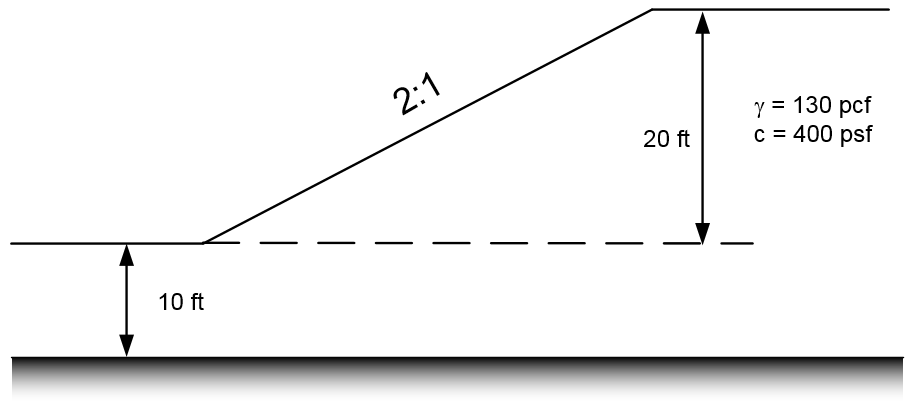
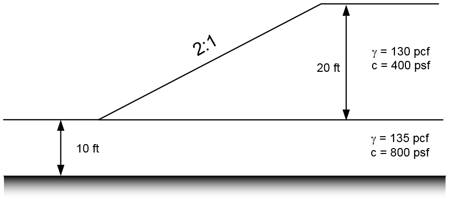
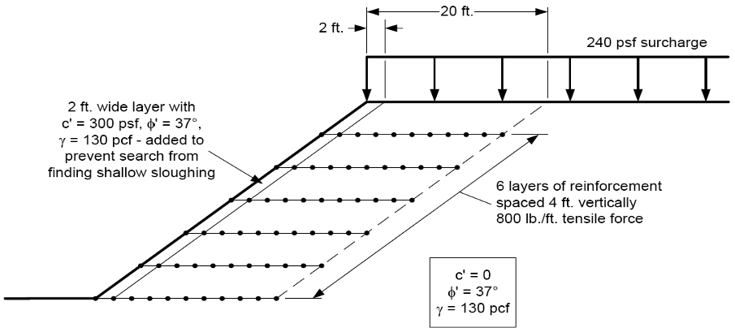

# Exercise: Finite Element Slope Stability Analysis

In this exercise, we will re-analyze four problems from earlier in the course using the Shear Strength Reduction Method (SSRM) with finite elements. For each problem, start with the XSLOPE input file from the corresponding LEM analysis and add Young's modulus ($E$) and Poisson's ratio ($\nu$) for each material. Use the values in the tables below, which are based on the typical elastic parameters discussed in the [FEM Overview](https://xslope.org/en/latest/fem/overview/){target="_blank"}.

After preparing each set of inputs, launch the XSLOPE FEM Google Colab notebook and upload your Excel input file:

Compare the FEM factor of safety to the LEM result from the earlier exercise. Note how the FEM method naturally reveals the failure mechanism through shear strain concentrations without requiring a prescribed failure surface.

## Problem 1 - Simple Slope with Foundation

This is the same problem from [XSLOPE Class Exercise 1, Problem 2](../05_xslope/xslope_class1.md).

Start with the LEM solution file and add the following elastic properties:

| Material | $E$ (psf) | $\nu$ |
|----------|:---------:|:-----:|
| Embankment/Foundation ($c$ = 400 psf, $\phi$ = 0) | 150,000 | 0.40 |

Since this is an undrained ($\phi = 0$) material, a Poisson's ratio of 0.40 is used rather than the theoretical undrained value of 0.5 to avoid numerical issues with near-incompressibility. The modulus is estimated as $E/S_u \approx 375$.

Starter template: [xslope_simple_foundation.xlsx](../05_xslope/files/xslope_simple_foundation.xlsx)

Solution: [fem_foundation.xlsx](files/fem_foundation.xlsx)

## Problem 2 - Slope with Multiple Layers

This is the same problem from [XSLOPE Class Exercise 1, Problem 3](../05_xslope/xslope_class1.md).

Start with the LEM solution file and add the following elastic properties:

| Material | $E$ (psf) | $\nu$ |
|----------|:---------:|:-----:|
| Upper ($c$ = 400 psf, $\phi$ = 0) | 150,000 | 0.40 |
| Lower ($c$ = 800 psf, $\phi$ = 0) | 300,000 | 0.40 |

Both layers are undrained ($\phi = 0$) with $E/S_u \approx 375$ and $\nu = 0.40$.

Starter template: [xslope_simple_mult_layers.xlsx](../05_xslope/files/xslope_simple_mult_layers.xlsx)

Solution: [fem_multilayer.xlsx](files/fem_multilayer.xlsx)

## Problem 3 - Non-Circular Failure Surface

This is the same problem from [XSLOPE Class Exercise 2, Problem 3](../05_xslope/xslope_class2.md). Note how the FEM method naturally finds the non-circular failure mechanism through the thin weak clay layer without any prior assumption about the failure surface shape.

Start with the LEM solution file and add the following elastic properties:

| Soil | $E$ (psf) | $\nu$ |
|------|:---------:|:-----:|
| Sand Fill ($c'$ = 0, $\phi'$ = 37°) | 1,000,000 | 0.30 |
| Sand ($c'$ = 0, $\phi'$ = 33°) | 700,000 | 0.30 |
| Soft Clay ($S_u$ = 200 psf, $\phi$ = 0) | 60,000 | 0.40 |
| Dense Sand ($c'$ = 0, $\phi'$ = 37°) | 1,500,000 | 0.28 |

The soft clay is modeled with $E/S_u \approx 300$ and $\nu = 0.40$ to avoid numerical issues with near-incompressibility. The sand layers use typical values from correlations for granular soils.

Starter template: [xslope_noncircular.xlsx](../05_xslope/files/xslope_noncircular.xlsx)

Solution: [fem_noncircular.xlsx](files/fem_noncircular.xlsx)

## Problem 4 - Reinforced Slope with Geogrid

This is the FEM version of the problem from the [Reinforced Slopes Exercise](../06_reinforced/reinforced_class.md). For additional details on how reinforcement is modeled using truss elements in the FEM method, see the [XSLOPE Soil Reinforcement](https://xslope.org/en/latest/fem/reinforcement/){target="_blank"} documentation.

Start with the LEM solution file and add the following elastic properties for the soil materials:

| Material | $E$ (psf) | $\nu$ |
|----------|:---------:|:-----:|
| Shell ($c$ = 300 psf, $\phi$ = 37°) | 1,000,000 | 0.3 |
| Base ($c$ = 0, $\phi$ = 37°) | 1,000,000 | 0.3 |

In the LEM analysis, the reinforcement was defined using the tensile strength and pullout length. The FEM analysis requires additional properties for each reinforcement line to model the stiffness and post-yield behavior of the geogrid elements. The following table summarizes the additional FEM reinforcement properties:

| Property | Description | Value |
|----------|-------------|:-----:|
| $T_{res}$ | Residual tensile force after yielding | 600 lb/ft |
| $E$ | Modulus of elasticity of reinforcement | 100,000 psf |
| $Area$ | Cross-sectional area of reinforcement | 0.1 ft$^2$/ft |

The product $EA$ = 10,000 lb/ft is the axial stiffness of the geogrid. Any combination of $E$ and $Area$ producing the same $EA$ will give identical results. The residual strength $T_{res}$ controls the post-yield behavior -- after an element exceeds $T_{max}$, its capacity drops to $T_{res}$ rather than failing completely. This peak-residual model is appropriate for ductile materials like geosynthetics.

Starter template: [xslope_reinforce.xlsx](../06_reinforced/files/xslope_reinforce.xlsx)

Solution: [fem_reinforce.xlsx](files/fem_reinforce.xlsx)
