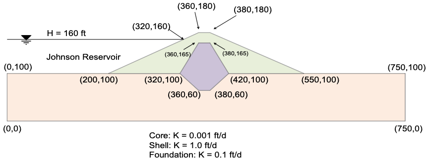

# Homework: Finite Element Slope Stability Analysis

In this assignment, you will perform finite element slope stability analyses on two problems using the Shear Strength Reduction Method (SSRM). For each problem, start with the provided XSLOPE input file and add Young's modulus ($E$) and Poisson's ratio ($\nu$) for each material. Then run both the LEM and FEM notebooks and compare the results.

**LEM Notebook:** 

**FEM Notebook:** 

## Part 1 - Non-Circular Failure Surface

This is the same problem from [XSLOPE Class Exercise 2, Problem 3](../05_xslope/xslope_class2.md). Note how the FEM method naturally finds the non-circular failure mechanism through the thin weak clay layer without any prior assumption about the failure surface shape.

### a. Add Elastic Properties

Start with the LEM solution file and add the following elastic properties:

| Soil | $E$ (psf) | $\nu$ |
|------|:---------:|:-----:|
| Sand Fill ($c'$ = 0, $\phi'$ = 37°) | 1,000,000 | 0.30 |
| Sand ($c'$ = 0, $\phi'$ = 33°) | 700,000 | 0.30 |
| Soft Clay ($S_u$ = 200 psf, $\phi$ = 0) | 60,000 | 0.40 |
| Dense Sand ($c'$ = 0, $\phi'$ = 37°) | 1,500,000 | 0.28 |

The soft clay is modeled with $E/S_u \approx 300$ and $\nu = 0.40$ to avoid numerical issues with near-incompressibility. The sand layers use typical values from correlations for granular soils.

Starter template: [xslope_noncircular.xlsx](../05_xslope/files/xslope_noncircular.xlsx)

### b. Run the LEM Analysis

Upload the file to the LEM notebook. Run the analysis using a non-circular failure surface. Note the critical factor of safety for each case.

### c. Run the FEM Analysis

Upload the same file to the FEM notebook. Use the LEM result to select appropriate values of $F_{min}$ and $F_{max}$ for the SSRM bisection. Note the computed factor of safety and examine the shear strain plot.

### d. Compare Results

Compare the LEM and FEM results. In your comparison, consider the following:

1. How do the circular and non-circular LEM factors of safety compare?
2. How does the FEM factor of safety compare to the LEM results?
3. Does the FEM shear strain plot confirm the non-circular failure mechanism through the weak clay layer?

*Thought exercise only - you do not need to submit answers to these questions.*

Save a copy of your input file (XLSX), the mesh file (JSON) and a PNG image of both the LEM and FEM solution plots (PNG). 

## Part 2 - Johnson Reservoir

This problem applies the FEM method to the Johnson Reservoir dam from the [Seepage/Slope Integration Homework](../07_seep_slope/seep_slope_hw.md). A starter zip archive is provided that includes the Excel input file with the dam geometry, strength properties, seepage material properties, and seepage boundary conditions already set up. The archive also includes the seepage solution (mesh and pore pressures) so you do not need to run the seepage analysis again.

### a. Add Elastic Properties

Open the Excel input file from the zip archive and add the following elastic properties ($E$ and $\nu$) to the **mat** sheet:

| Material | $\gamma$ (pcf) | $c'$ (psf) | $\phi'$ (deg) | $E$ (psf) | $\nu$ |
|:--------:|:------:|:------:|:------:|:---------:|:-----:|
| Shell    |  130   |  100   |   35   | 1,000,000 | 0.30  |
| Core     |  125   |  400   |   18   |   300,000 | 0.35  |
| Foundation | 127  |  100   |   27   |   700,000 | 0.30  |

Also, be sure to change the pore pressure option to `seep` for all materials in the **mat** sheet so that the LEM and FEM analyses will use the pore pressures from the seepage solution.

Save the updated Excel file and re-zip it with the mesh and seepage solution files.

Starter template: [xslope_johnson_res_fem.zip](files/xslope_johnson_res_fem.zip)

### b. Run the LEM Analysis

Upload the zip archive to the LEM notebook and run the slope stability analysis on the downstream side using Spencer's method. Note the critical factor of safety.

### c. Run the FEM Analysis

Upload the same zip archive to the FEM notebook. Use the LEM result to select appropriate values of $F_{min}$ and $F_{max}$ for the SSRM bisection. Run the FEM analysis and note the computed factor of safety.

### d. Compare Results

Compare the LEM and FEM results. 

1. How does the FEM factor of safety compare to the LEM result?
2. Examine the FEM shear strain plot. Does it reveal the same failure mechanism as the LEM analysis?
3. Note that unlike the LEM analysis, you did not need to specify whether to analyze the upstream or downstream side. Which side does the FEM identify as critical?

*Thought exercise only - you do not need to submit answers to these questions.*

Save a copy of your input file (XLSX), the mesh file (JSON), the seepage solution file (CSV), and a PNG image of both the LEM and FEM solution plots (PNG). 

## Submission

 Zip up all files described above for both problems into a single zip archive. Upload your zip archive via Learning Suite.

## Grading Rubric

**Total: 30 points**

### Part 1 - Non-Circular Failure Surface (15 points)

| Criteria | Points |
|----------|:------:|
| Elastic properties ($E$, $\nu$) entered correctly for all four materials | 4 |
| LEM analysis run with non-circular failure surface | 4 |
| FEM analysis produces correct factor of safety | 4 |
| Files (XLSX, JSON) and PNG solution plots properly submitted | 3 |

### Part 2 - Johnson Reservoir (15 points)

| Criteria | Points |
|----------|:------:|
| Elastic properties ($E$, $\nu$) entered correctly and pore pressure set to `seep` | 4 |
| LEM analysis run with seepage-derived pore pressures | 4 |
| FEM analysis produces correct factor of safety | 4 |
| Files (XLSX, JSON, CSV) and PNG solution plots properly submitted | 3 |
