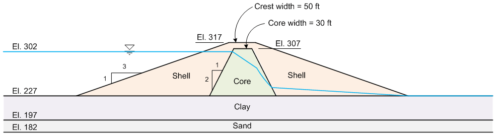

# Homework: Finite Element Slope Stability Analysis

In this assignment, you will perform a finite element slope stability analysis on the earth dam problem from previous homework assignments using the Shear Strength Reduction Method (SSRM). This time we will use the FEM approach to find the critical factor of safety without specifying a failure surface shape or searching separately for upstream and downstream failure modes.

A starter zip archive is provided that includes the Excel input file with the dam geometry, strength properties, seepage material properties, and seepage boundary conditions already set up. The archive also includes the seepage solution (mesh and pore pressures) so you do not need to run the seepage analysis again.

Starter template: [xslope_earth_dam_fem_start.zip](files/xslope_earth_dam_fem_start.zip)

**LEM Notebook:**

**FEM Notebook:**

## Instructions

### 1. Add Elastic Properties

Open the Excel input file from the zip archive and add the following elastic properties ($E$ and $\nu$) to the **mat** sheet:

| Material | $\gamma$ (pcf) | $c'$ (psf) | $\phi'$ (deg) | $E$ (psf) | $\nu$ |
|:--------:|:------:|:------:|:------:|:---------:|:-----:|
| Shell    |  125   |   0    |   34   | 700,000   | 0.30  |
| Core     |  122   |  100   |   26   | 300,000   | 0.35  |
| Clay     |  123   |   0    |   24   | 200,000   | 0.35  |
| Sand     |  127   |   0    |   32   | 1,000,000 | 0.30  |

Save the updated Excel file and re-zip it with the mesh and seepage solution files.

### 2. Run the LEM Analysis

Upload the zip archive to the **LEM notebook** and run the slope stability analysis on the downstream side using Spencer's method. Note the critical factor of safety. Recall from the [seepage/slope integration exercise, Problem 2](../07_seep_slope/seep_slope_class.md) that the seepage-derived pore pressures produce a localized failure near the downstream toe of the dam due to high pore pressures from seepage flow through the foundation layers. This is very different from the result you get with a piezometric line.

### 3. Run the FEM Analysis

Upload the same zip archive to the **FEM notebook**. Note the location of the critical circle and the low FS. You will not be able to use this to guide the selection of $F_{min}$ and $F_{max}$ for the FEM analysis, so you will need to make an educated guess based on the LEM result. Recall that with a piezometric line, the critical FS = ~1.2  Thus, you might choose $F_{min} = 1.0$ and $F_{max} = 1.4$ for the FEM analysis. 

Run the FEM analysis and note the computed factor of safety. Note: to get a good seepage solution, a relatively fine mesh is needed, which can lead to long FEM solution times. Be patient.

### 4. Compare Results

Compare the LEM and FEM results. In your comparison, address the following:

1. How does the FEM factor of safety compare to the LEM result?
2. Examine the FEM shear strain plot. Does the FEM find the same localized toe failure that the LEM found, or does it reveal a different failure mechanism? Or does it indicate two potential failure mechanisms (localized toe vs. general failure)? 
3. Note that unlike the LEM analysis, you did not need to specify whether to analyze the upstream or downstream side. The FEM naturally finds the critical failure mechanism through the global stress field. Which side does the FEM identify as critical?

(these are thought questions - you don't need to submit a written answer)

## Submission

Save a copy of your Excel input file, the mesh file, and PNG images of both the LEM and FEM solution plots. Zip up your files into a single zip archive. Upload your zip archive via Learning Suite.

## Grading Rubric

**Total: 30 points**

| Criteria | Points |
|----------|:------:|
| Elastic properties ($E$, $\nu$) entered correctly for all four materials | 5 |
| LEM analysis run with seepage-derived pore pressures (downstream side, Spencer's method) | 5 |
| LEM critical factor of safety reported | 3 |
| FEM analysis run with appropriate $F_{min}$ and $F_{max}$ based on LEM result | 5 |
| FEM factor of safety reported | 3 |
| Comparison of LEM vs. FEM factor of safety | 3 |
| Discussion of failure mechanism (localized toe vs. general failure) | 3 |
| Discussion of which side the FEM identifies as critical | 2 |
| Files and PNG solution plots properly submitted in zip archive | 1 |
